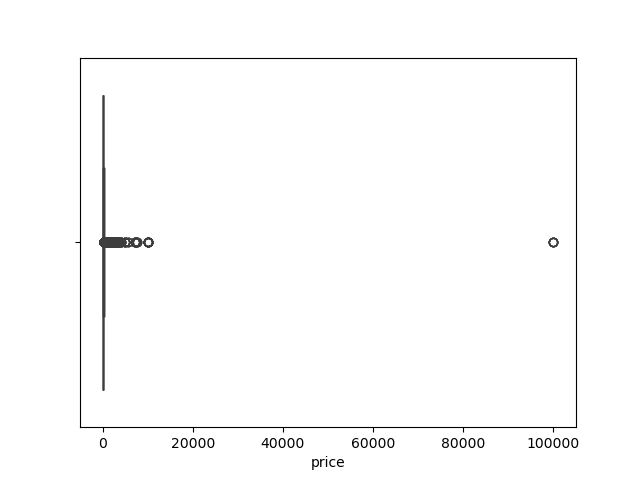

# 🏠 Airbnb NYC 2025 Analysis — Data Exploration with Python

Welcome to an in-depth data analysis project where I dive into the vibrant world of Airbnb listings across **New York City**. Using Python, I explored pricing trends, availability patterns, room types, and geographical insights to answer: _What drives Airbnb listing prices in NYC?_

---

## 🎯 Project Objectives

✅ Load, clean, and preprocess the dataset  
✅ Visualize trends in price, reviews, room types, and geography  
✅ Identify and treat outliers to improve analysis accuracy  
✅ Investigate how boroughs and neighborhoods affect pricing  
✅ Generate actionable insights using Python libraries  

---

## 📁 Dataset Overview

- **Source:** InsideAirBnB or a similar public dataset  
- **Key Features:**  
  - `neighbourhood_group` (e.g., Manhattan, Brooklyn)  
  - `room_type` (Private room, Entire home/apt, etc.)  
  - `price`, `minimum_nights`, `reviews_per_month`  
  - `availability_365`, `number_of_reviews`  
- **Size:** ~49,000 listings (subject to filtering)

---

## 📊 Exploratory Visuals & Insights

### 💸 Price Outlier Detection
Using a **boxplot**, I detected extreme price outliers. These typically represent luxury listings or data errors.

---

### 💵 Price Distribution: Before vs. After Filtering

To better understand pricing behavior, I visualized the distribution before and after excluding listings priced above $1500.

**Before Filtering:**

**After Filtering:**

---

### 🛏️ Room Type Breakdown

A bar plot shows that "Entire home/apt" dominates the listing count, followed by "Private room".

---

### 🌇 Neighborhood vs. Price Heatmap

A borough-level heatmap displays average listing prices, highlighting **Manhattan** as the most expensive location.

---

### 📍 Geographical Distribution of Listings

I mapped latitude and longitude of listings across NYC to visualize dense hotspots. Manhattan and Brooklyn stand out as the most active regions.

---

### 🌐 Locality vs. Review Dependency

Listings in high-demand areas like **Brooklyn** and **Manhattan** tend to receive more reviews per month, revealing demand hotspots.

---

### 🔍 Pairplot: Feature Relationships

A **Seaborn pairplot** helps visualize interrelations between price, availability, and review counts. It reveals patterns and clusters among different room types.

---

## 🛠 Tools & Technologies

- **Python 3.9+**
- **Pandas**, **NumPy** – Data cleaning & manipulation  
- **Matplotlib**, **Seaborn** – Data visualization  
- **Jupyter Notebook** – Analysis & narrative integration  

---

## 📌 Key Takeaways

- 🏙️ **Manhattan listings** command the highest prices, especially entire apartments.  
- 📊 Filtering outliers (e.g., prices > $1500) improves analytical clarity.  
- 🔁 **Room type** and **neighborhood** are major drivers of pricing.  
- 📍 Listings in high-demand neighborhoods receive significantly more reviews per month.  
- 🔎 Data visualization is critical for spotting patterns and making informed decisions.

---

